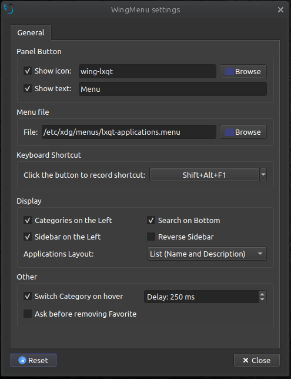
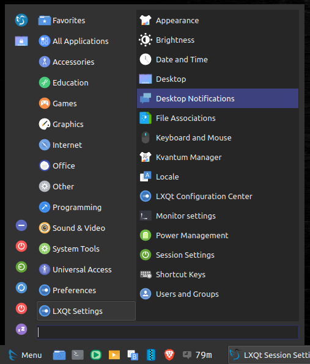
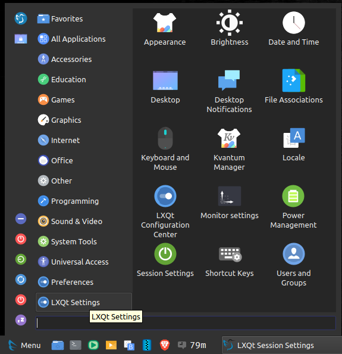

# Wing Menu is an alternative menu plugin for [lxqt-panel](https://github.com/lxqt/lxqt-panel)

It has two columns instead of the "classic menu" and was inspired by Xfce's [Whisker Menu](https://docs.xfce.org/panel-plugins/xfce4-whiskermenu-plugin/start)

## Screenshots

### Settings:



### Name and Description View:


### Name Only View:



### Icons View:



## Installation:

### Dependencies:

#### Lubuntu (22.04)

```
sudo apt install git build-essential cmake qttools5-dev \
liblxqt0-dev libkf5windowsystem-dev libqt5x11extras5-dev \
liblxqt-globalkeys-ui0-dev liblxqt-globalkeys0-dev
```

#### Arch Linux

```
sudo pacman --needed -S git base-devel cmake liblxqt \
lxqt-build-tools qt5-base kwindowsystem qt5-x11extras
```

### Compile and install plugin:

```bash
# clone repo
git clone https://github.com/slidinghotdog/plugin-wingmenu.git

# cd into folder
cd plugin-wingmenu

# run install script
bash install.sh

```

#### Note: it's not well integrated with LXQt Themes, try it with "System" theme.

If everything was successful, you should have a new plugin ready to be added to your panel, named `Wing Menu (wingmenu)`.
