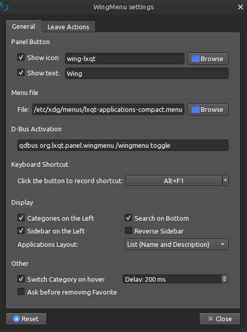

# Wing Menu is an alternative menu plugin for [lxqt-panel](https://github.com/lxqt/lxqt-panel) (Updated for LXQt 2.0)

It has two columns instead of the "classic menu" and was inspired by Xfce's [Whisker Menu](https://docs.xfce.org/panel-plugins/xfce4-whiskermenu-plugin/start)

Can be activated via D-Bus `qdbus org.lxqt.panel.wingmenu /wingmenu toggle` (or wingmenu2, wingmenu3, etc). Exact command is available in the Settings window.

NOTE: If the D-Bus command is set as a global shortcut, the menu might block the detection of the shortcut when it's open, so it might not work for hiding it (Esc always works for hiding it).

License: [LGPL-2.1+](LICENSE "License")

## Translations
You can contribute with translations on [Weblate](https://translate.lxqt-project.org/projects/elviosak/)

[](https://translate.lxqt-project.org/engage/elviosak/?utm_source=widget)

## Screenshots

### Settings:



### Name and Description View:


### Name Only View:


### Icons View:


## Installation:

### Dependencies:

- lxqt-build-tools 2.0+
- liblxqt 2.0+
- libqtxdg 4.0+
- lxqt-panel 2.0+
- lxqt-globalkeys 2.0+
- KWindowSystem 6.0+
- Qt 6

### Compile and install plugin:

#### Arch Linux (install dependencies)

```
sudo pacman --needed -S git base-devel cmake lxqt-build-tools \
liblxqt libqtxdg lxqt-globalkeys lxqt-panel kwindowsystem qt6-base
```

#### Clone repo and install

```bash
# clone repo
git clone https://github.com/elviosak/plugin-wingmenu.git

# cd into folder
cd plugin-wingmenu

# run install script
bash install.sh

```

#### Note: it's not well integrated with actual LXQt Themes, try it with "System" theme and "Fusion" widget style.

WIP branch for Wing Menu styling in themes: https://github.com/lxqt/lxqt-themes/tree/wing-menu-fixes


If everything was successful, you should have a new plugin ready to be added to your panel, named `Wing Menu (wingmenu)`.
